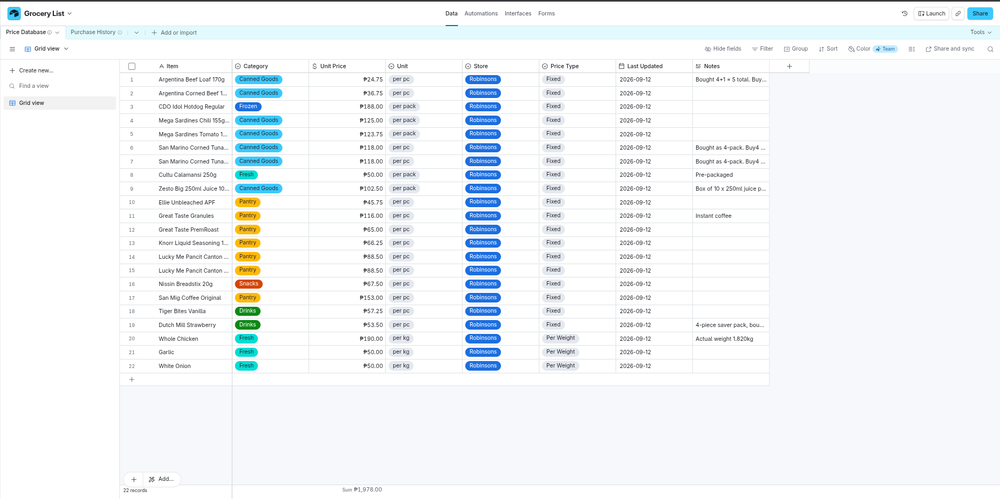
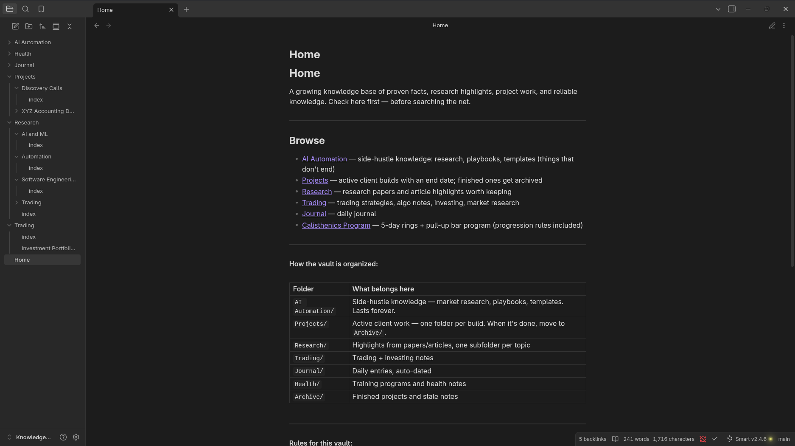
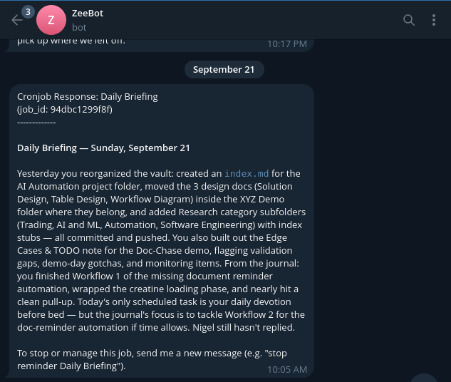
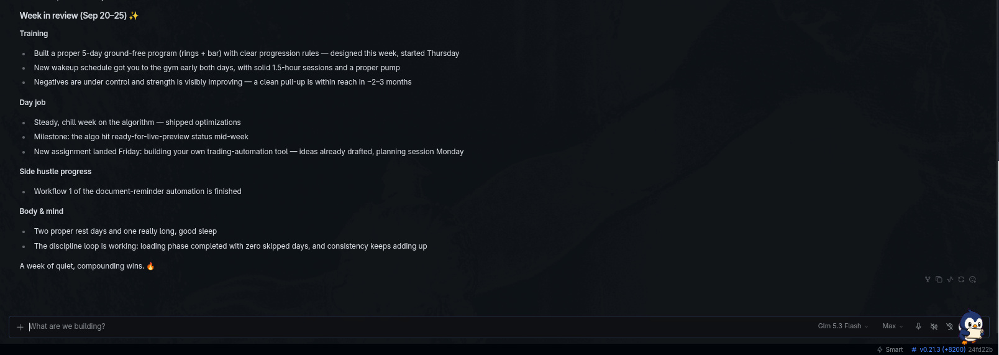
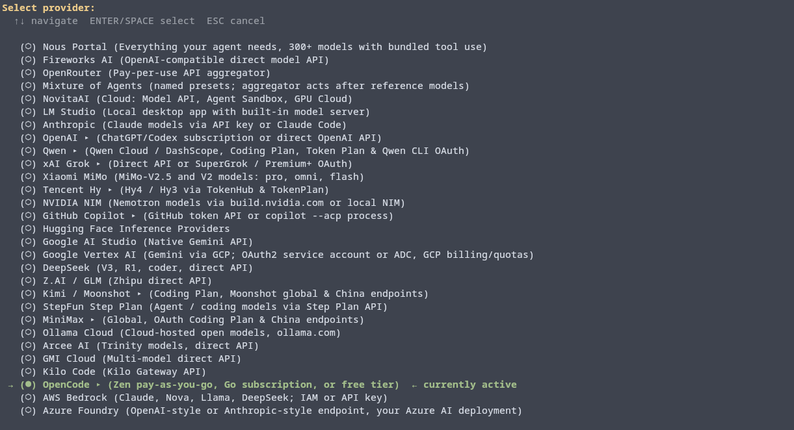
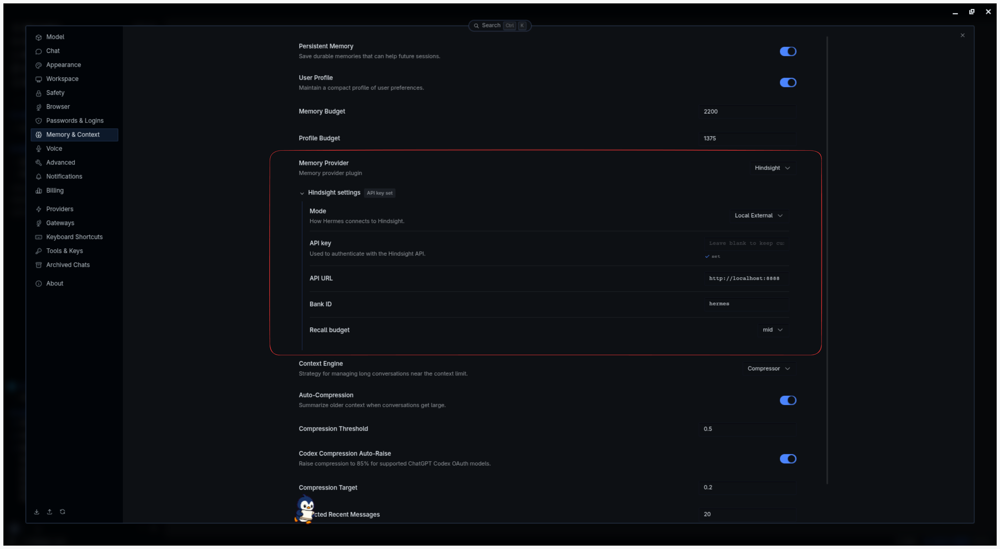
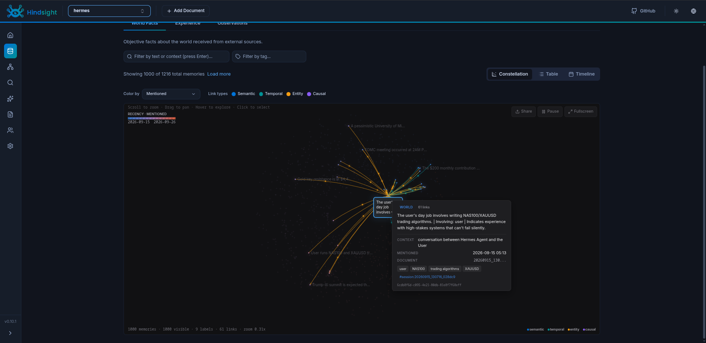

## Introduction

AI agents are everywhere now, but most of them share the same two problems: they're expensive to run, and they forget everything the moment you close the chat.

For the past while I've been running [Hermes Agent](https://hermes-agent.nousresearch.com/) by Nous Research on my own machine. It's open source, it runs locally, and it can talk to me from the terminal or from apps I already use like Telegram. Pair it with a cheap model subscription and a local memory layer, and you get an agent that costs about the same as a streaming subscription and actually remembers what you've told it.

In this post I'll walk through my exact setup:

- **Hermes Agent** as the agent itself, running on my machine
- **OpenCode Go** ($10/month) as the model provider
- **Hindsight**, running locally, as long-term memory so the agent improves over time

## Where I Use Hermes

There are a lot of ways to use Hermes. For me, it manages my day-to-day life. It's like having a personal assistant for $10 a month.

It keeps my todo list in [Todoist](https://www.todoist.com/), so I can access it from anywhere. The integration was easy to set up.

It also plans my groceries. I use [Airtable](https://www.airtable.com/) as a database of prices for what I buy, so Hermes can help me stay within budget over time.



*My grocery price database in Airtable. Hermes reads it when planning a shopping trip.*

It's my second brain, too. We brainstorm together, and it can search the internet and scrape pages with [Firecrawl](https://www.firecrawl.dev/) and [Apify](https://apify.com/). It stores my journal, facts, and knowledge in [Obsidian](https://obsidian.md/) for later.



*The Obsidian vault Hermes keeps organized for me.*

It also gives me a daily briefing: what happened yesterday, which tasks I need to finish, and the day's news.



*A daily briefing Hermes sent me on Telegram.*



*A week in review in the Hermes desktop app.*

The part that sold me is that it's not just a chat window. It lives on my machine, has access to tools, and I can reach it from my phone.

## What You'll Need

- A computer running Linux, macOS, or Windows (WSL2 or PowerShell)
- About **$10/month** for OpenCode Go
- Docker, to run Hindsight (optional, but it's how I run it)

That's it. No GPU required, since the heavy model inference happens on OpenCode Go's side. Hermes and its memory run on your machine.

## Step 1: Subscribe to OpenCode Go

[OpenCode Go](https://opencode.ai/docs/go/) is a $10/month subscription that gives you access to a curated set of open models, like DeepSeek, Qwen, GLM, and Kimi, through an OpenAI-compatible API. It's built for coding agents, and Hermes is one of the officially validated clients.

1. Go to [opencode.ai/auth](https://opencode.ai/auth) and sign in.
2. Subscribe to **Go**.
3. Copy your **API key**. You'll need it in the next step.

A quick note on limits: usage is capped in 5-hour, weekly, and monthly windows (20%, 50%, and 100% of your monthly allowance). For personal agent use I rarely hit them, but if you run heavy automations, keep an eye on it.

## Step 2: Install Hermes

On Linux, macOS, or WSL2:

```bash
curl -fsSL https://hermes-agent.nousresearch.com/install.sh | bash
```

On Windows (PowerShell):

```powershell
iex (irm https://hermes-agent.nousresearch.com/install.ps1)
```

Once installed, point Hermes at OpenCode Go. First, add your key to `~/.hermes/.env`:

```bash
OPENCODE_GO_API_KEY=your-api-key
```

Then pick your model:

```bash
hermes model
```



*Hermes's provider picker in the terminal.*

Choose **OpenCode** as the provider (it covers the Go subscription) and select a model from the catalog. This gets saved to `~/.hermes/config.yaml`:

```yaml
model:
  provider: "opencode-go"
  default: "your-model-name"
```

My daily driver is GLM-5.3-Flash on the max setting. It's good enough for what I do, and it's cheap. I rarely hit the 5-hour limit, even with big context windows.

You can switch models mid-conversation with `/model opencode-go:<model-name>`, which is handy for trying a stronger model on a hard task and dropping back to a cheaper one after.

Now run `hermes` to start chatting in the terminal, or `hermes desktop` to install the desktop app, and say hi.

## Step 3: Make It Improve Over Time with Hindsight

Out of the box, Hermes already has some memory: it keeps notes across sessions and can write its own reusable "skills." But I wanted something stronger, so I added [Hindsight](https://hindsight.vectorize.io/), an open-source (MIT) memory layer that has a native Hermes plugin.

Hindsight extracts facts and entities from your conversations, stores them, and lets the agent search them later. Hermes gets three new tools:

- `hindsight_retain`: save something worth remembering
- `hindsight_recall`: search past memories
- `hindsight_reflect`: reason across many memories to answer bigger questions

I run Hindsight with Docker Compose because it's the easiest to set up and keep running. Save this as `docker-compose.yml`:

```yaml
services:
  hindsight:
    image: ghcr.io/vectorize-io/hindsight:latest
    pull_policy: always
    shm_size: "1g"
    ports:
      - "8888:8888"
      - "9999:9999"
    environment:
      - HINDSIGHT_API_LLM_PROVIDER=opencode-go
      - HINDSIGHT_API_LLM_API_KEY=your-api-key
      - HINDSIGHT_API_LLM_MODEL=mimo-v2.6-flash
    volumes:
      - hindsight-data:/home/hindsight/.pg0
    restart: unless-stopped

volumes:
  hindsight-data:
```

Hindsight still needs an LLM to extract facts from your conversations, and here's the nice part: it supports OpenCode Go directly, so the same $10 subscription covers it. Put your OpenCode Go key in `HINDSIGHT_API_LLM_API_KEY`, then start it:

```bash
docker compose up -d
```

The API runs on port `8888`, and the web UI on [localhost:9999](http://localhost:9999), where you can browse what your agent has learned about you. The data lives in the `hindsight-data` volume, so it survives restarts and image updates.

Next, install the plugin and run the memory setup:

```bash
hermes plugins install hindsight
hermes memory setup   # select "hindsight"
```

When the wizard asks for a mode, choose **`local_external`** and point it at `http://localhost:8888`. The config lives in `~/.hermes/hindsight/config.json` if you want to tweak it later.



*You can also set this in the desktop app under Memory & Context: pick Hindsight as the memory provider, set the mode to Local External, and enter the API URL.*

Don't want Docker? Choose **`local_embedded`** instead. Hermes then runs Hindsight itself, and you set the LLM in `~/.hermes/.env` using OpenCode Go's OpenAI-compatible endpoint:

```bash
HINDSIGHT_LLM_API_KEY=your-opencode-go-api-key
HINDSIGHT_API_LLM_BASE_URL=https://opencode.ai/zen/go/v1
```

In that mode, open the web UI with `hindsight-embed -p hermes ui start`.



*After about ten days of use, Hindsight had saved over 1,000 memories. Hovering over one shows the fact, where it came from, and its links to others.*

## Advantages of This Setup

- **Cheap and predictable.** One $10/month subscription covers both the agent and its memory. No surprise API bills.
- **Your data stays with you.** Hermes and Hindsight run on your machine. Only the model calls leave it.
- **It gets better over time.** The more you use it, the more context it has about you, your projects, and how you like things done.
- **No lock-in.** Everything is open source. If a better model shows up, switching is one `hermes model` away.
- **Reachable anywhere.** Connect it to Telegram, Discord, Slack, and 20+ other platforms and use it from your phone.

## Trade-offs

To be fair, it's not perfect:

- **The model isn't local.** Your prompts go to OpenCode Go's servers. If you need fully offline, you'll want a local model through Ollama, which needs decent hardware.
- **Usage limits.** Heavy workloads can hit the 5-hour or weekly caps.
- **Open models aren't frontier models.** They're very capable, but for the hardest tasks a top-tier model can still do better.

## Conclusion

For about $10 a month you get a personal AI agent that runs on your machine, talks to you wherever you are, and builds up memory over time instead of starting from zero every chat. It's the setup I'd recommend to anyone who wants to play with AI agents without committing to expensive API bills.

This setup has made my day-to-day life much more efficient. I don't have to jump between apps to manage my tasks anymore, and whenever I need something new, I can just hand another app over to my assistant.
