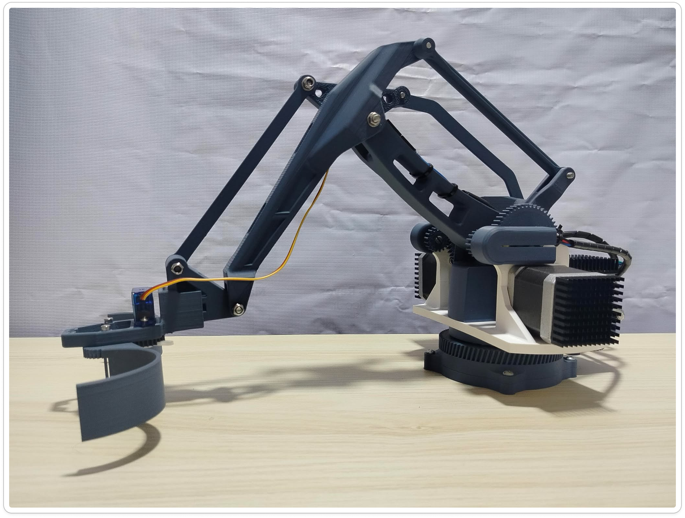
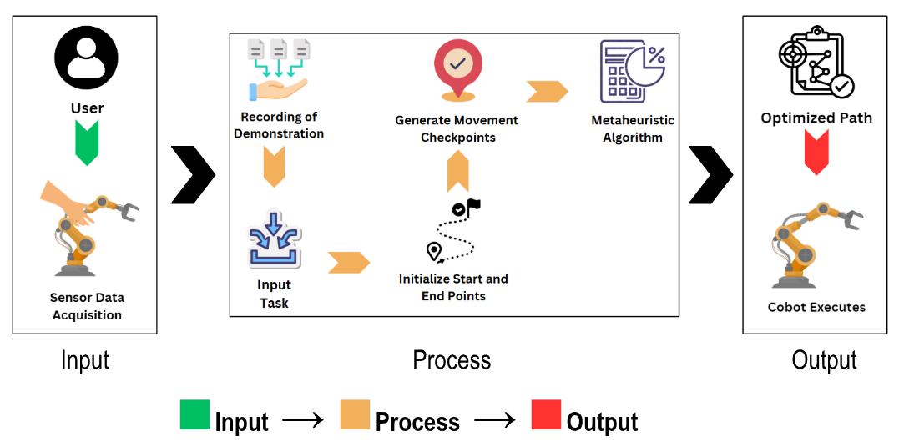
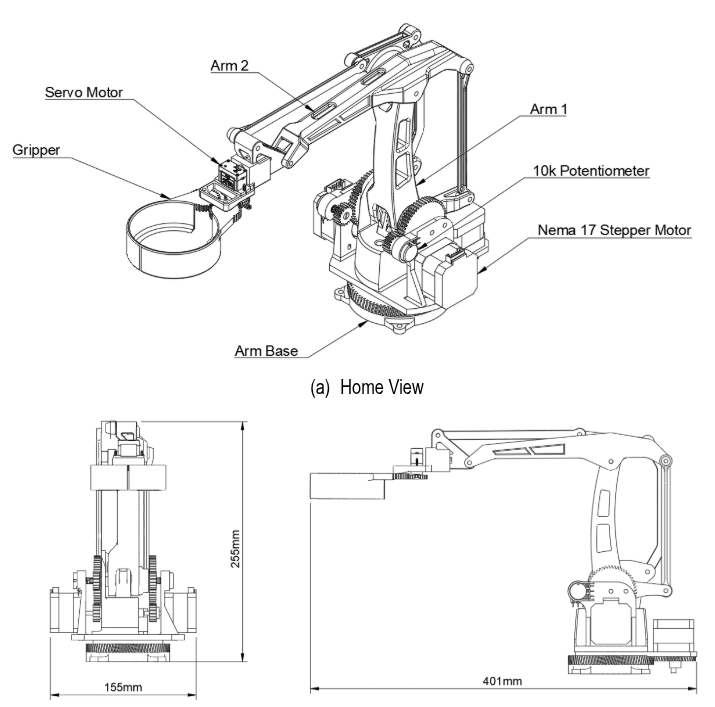
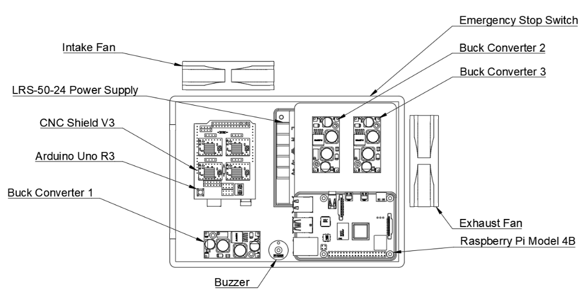
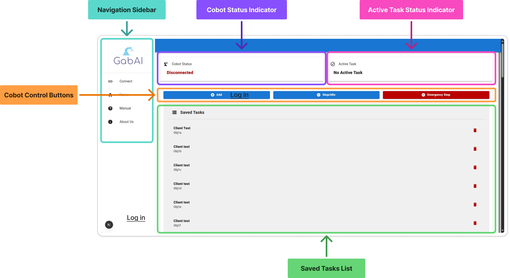
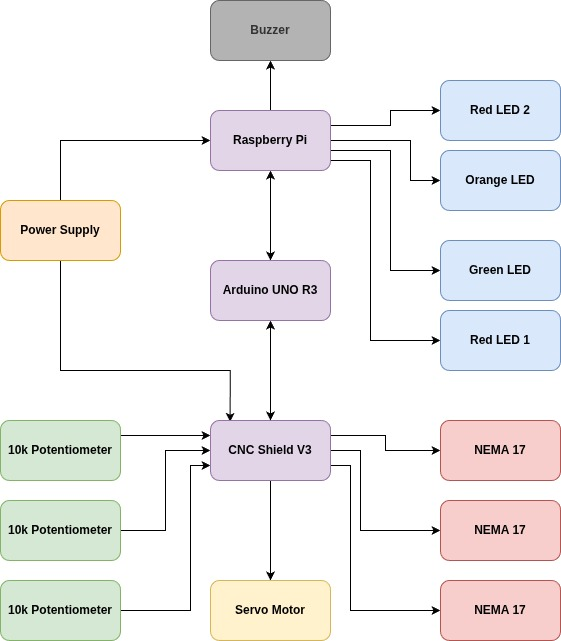
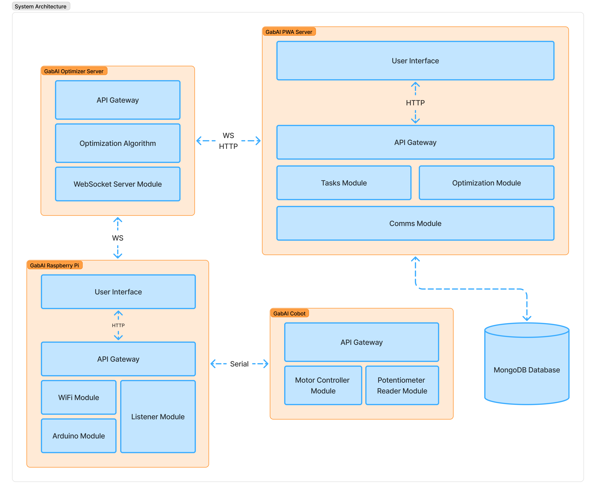
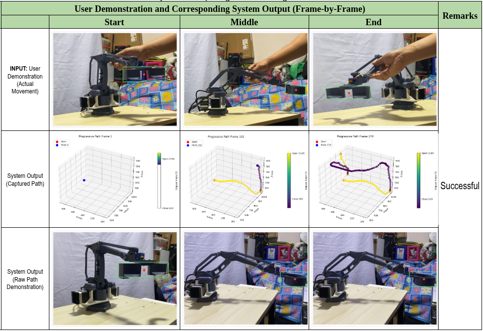
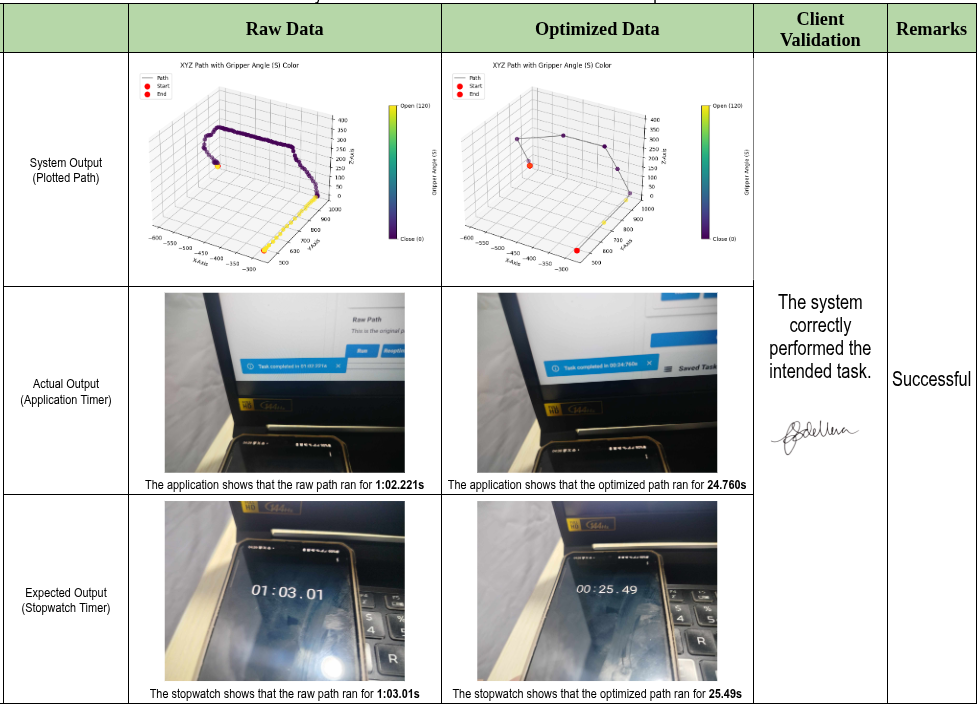
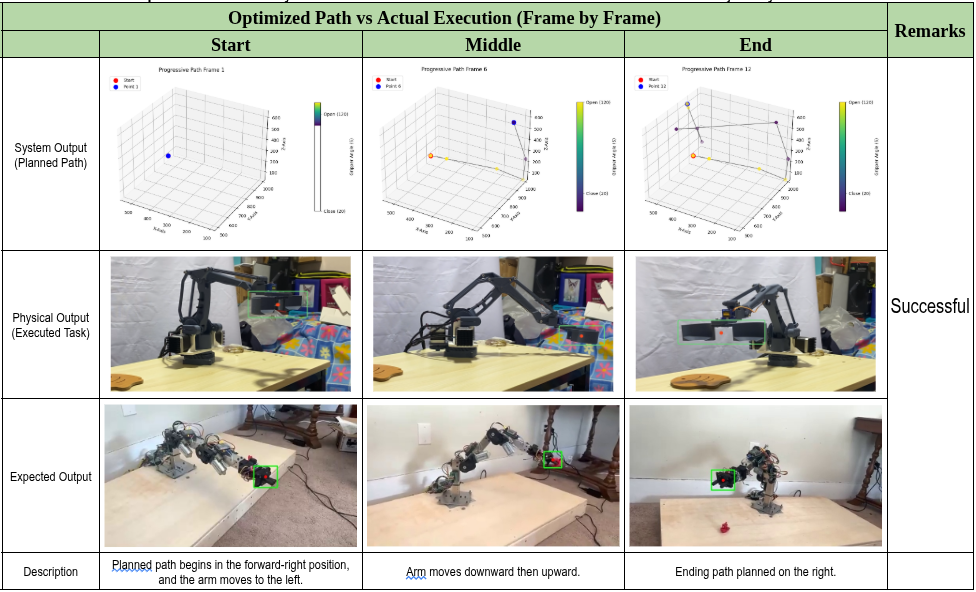

<small>_Co-authors: Jerico Delos Reyes Jr.; Miles Joshua Lagao; and, Kevin Roi Sumaya_</small>

## Summary

Collaborative robots (cobots) are increasingly used to assist people with various tasks, particularly in dynamic environments where flexibility and adaptability are essential. One common way to teach cobots is through Learning from Demonstration (LfD), where users physically guide the robot through the desired motion. While this approach is intuitive, it often captures unintended movements and inconsistent trajectories, resulting in inefficient paths. To address this challenge, this study developed a 3D-printed collaborative robot arm integrated with a metaheuristic optimization system that evaluated three algorithms: Genetic Algorithm (GA), Particle Swarm Optimization (PSO), and Biogeography-Based Optimization (BBO). Among these, GA consistently produced the best results. The system, integrated through a Progressive Web Application (PWA), successfully optimized all 20 recorded demonstration paths during testing, achieving 100% accuracy in preserving the intended task while improving path efficiency.

## The Problem

Repetitive and physically demanding tasks are a major cause of workplace injuries, making automation an important solution. While industrial robots can automate these tasks, they are often expensive and require specialized programming, limiting their use in small and medium-sized enterprises. Collaborative robots (cobots) provide a more flexible and affordable alternative, especially when programmed through Learning from Demonstration (LfD), where users physically guide the robot. However, demonstrations often produce inconsistent and inefficient motion paths. This project addresses that limitation by developing an optimized path generation method using a metaheuristic algorithm, improving cobot efficiency while supporting safer workplaces and contributing to the UN Sustainable Development Goal 8 on decent work and economic growth.

## Project Objectives

The project aims to design and develop a physical guidance-driven collaborative robot that uses metaheuristic algorithms to generate optimized motion paths from user demonstrations while complying with relevant engineering standards and considering efficiency, safety, maintainability, environmental, economic, and ethical factors.

## The Solution

The project is a physical guidance-driven collaborative robot that learns tasks through user demonstrations and uses metaheuristic algorithms to optimize motion paths before execution.

It features a 3-DOF robotic arm with a gripper, wireless connectivity, and safety features compliant with collaborative robot standards.

A progressive web application enables users to record, manage, visualize, and execute demonstrated tasks, communicate with the robot wirelessly, and perform emergency stops, providing an intuitive interface for efficient and safe robot operation.

## Technical Implementation

The system is a pipeline: a human moves the arm, the path is recorded, an optimizer smooths it, then the arm replays. Four layers feed that pipeline — hardware, recording, optimization, and the interface that ties it all together.

**Hardware.** The arm is 3-DOF and fully 3D-printed alongside with a box that houses the essential components to run it. Three Nema 17 stepper motors drive each joint and a servo motor controls the gripper, with an Arduino handling low-level control and reading the joint feedback using potentiometers. Through serial connectivity, the Arduino controls the CNC shield and carries commands to and from the connected Raspberry Pi 4B.

**Recording the path.** When the user grabs the arm and moves it, the joint positions are sampled at a fixed rate and stored as a sequence of waypoints. The recording is the source of truth that will be optimized by the chosen metaheuristic algorithm.

**The optimizer.** Three metaheuristics were tested against the same recorded paths: Genetic Algorithm, Particle Swarm Optimization, and Biogeography-Based Optimization. The fitness function tried to balance three things, keep the task intact (endpoints and key waypoints), shorten the path, and reduce jerk between segments. Population sizes and generation counts were tuned by hand. GA was the one that consistently landed on a better solution within a reasonable number of iterations.

**The PWA.** Browser-based, talks to the Raspberry Pi over WiFi. The user can record, replay the raw path, run the optimized path, or hit an emergency stop. The interface is intentionally simple — the whole point of LfD is that the user shouldn't need to know what's happening under the hood.

## Challenges

We encountered many challenges throughout this project. Here are some of the most significant ones:

**Sensor noise.** The potentiometers used to measure the joint positions were noisy enough that even a stationary arm produced fluctuating readings. To address this, we applied a Gaussian filter before the optimization process to smooth the data and reduce noise. Without this preprocessing step, the genetic algorithm (GA) would optimize the noise instead of the actual path.

**Tuning without a reference.** We had no labeled dataset of "good" cobot trajectories to use as a benchmark. Every parameter, including the population size, mutation rate, and number of generations, had to be tuned experimentally by observing whether the generated paths became shorter across a handful of demonstrations and evaluating the results qualitatively.

**Implementing the optimizer.** An optimizer is only as effective as the data it receives. We spent weeks determining how to properly implement the optimizer and design an appropriate fitness function to achieve the best results. We also had to carefully preprocess the demonstration data to reduce noise and prevent the optimizer from converging to poor local optima.

**Unoptimized code.** Due to time constraints, we were unable to optimize much of the software, particularly the Arduino code. We believe there are more efficient ways to implement several parts of the system, but we did not have enough time to explore and test those improvements. Instead, we focused on delivering a solution that was reliable and functional.

**Designing the collaborative arm.** The system uses a 3-DOF robotic arm with a gripper. Its mechanical design was based on an open-source project, which we modified to better suit our application. We also had to carefully integrate the additional components required to enable learning through physical guidance while maintaining the arm's functionality and ease of use.

## Results

All 20 recorded demonstration paths were successfully optimized, resulting in a 100% task fidelity rate. The robotic arm reproduced the intended motion in every trial, and the optimized paths were consistently shorter and smoother than the original recorded trajectories. In this context, "optimized" means that the execution time was reduced compared to the unoptimized path, and the jerk between consecutive waypoints was lower.

**The first test.** This figure shows one representative run out of 20 trials conducted to verify that the collaborative robot correctly records and executes the raw demonstration path. The first row shows the user demonstration, the second row shows the recorded path visualized in 3D, and the third row shows the robot executing the recorded path.

**The second test.** This figure shows one representative run out of 20 trials conducted to verify that the recorded path is successfully optimized. The first row compares the path before and after optimization. The second row shows the execution time reported by the application, while the third row shows the actual execution time measured using a stopwatch. The measured times were consistent across both methods.
**The third test.** This test includes a reference robot from an external source to verify that the collaborative robot can perform the intended task. This figure shows one representative run out of 20 trials evaluating the execution of the optimized path. The first row shows the waypoint-by-waypoint progression of the robot, the second row shows the execution performed by the developed collaborative robot, and the third row shows the execution performed by the reference robot. The results were consistent, demonstrating that the optimized path preserved the intended task while reducing execution time.

## Lesson Learned

A few things stuck with me after the project wrapped.

**On the technical side:** the optimizer is only as good as the data you feed it. We spent weeks tuning GA parameters and almost no time thinking about whether the recorded path was the right thing to optimize. Half a day on sensor filtering would have saved us weeks of "why isn't this converging."

**On project management:** build the first and dumbest end-to-end version first, then iterate on that. Our first working demo was a fully built system which made it limited for us to make some improvements without breaking the whole thing and costing us our budget.

**On collaboration:** I didn't build this alone. Jerico and Kevin handled the algorithm, Miles worked on the PWA frontend and some of the hardware, and I worked on designing the hardware and integrating the whole system and making sure everything they've built is connected properly. The thing I'm proudest of isn't any one piece — it's that we trusted each other to own our parts. This allowed us to deliver a project that was both functional and reliable.

## Future Improvements

Where this could go, framed as next steps rather than gaps:

- **Smarter optimization.** Try different optimization methods. There might be a better optimization that is suited for this kind of task.
- **Vision and task understanding.** Add a simple camera and object detection so the cobot can adjust to where things actually are, not just where the user thinks they are.
- **More DOFs.** Add more DOFs to the arm to allow for more complex tasks.
- **Encoders instead of potentiometers.** Use encoders to measure the joint positions instead of potentiometers. This would allow for more precise control and reduce noise.
- **Better gear design.** There might be a better gear design that allows for more precise control and reduced slippage.
