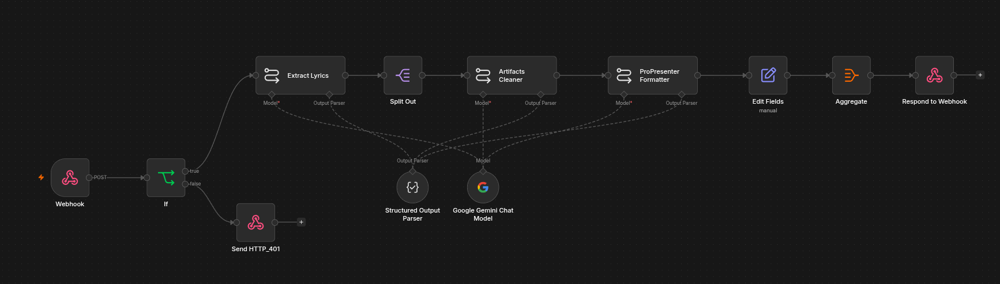
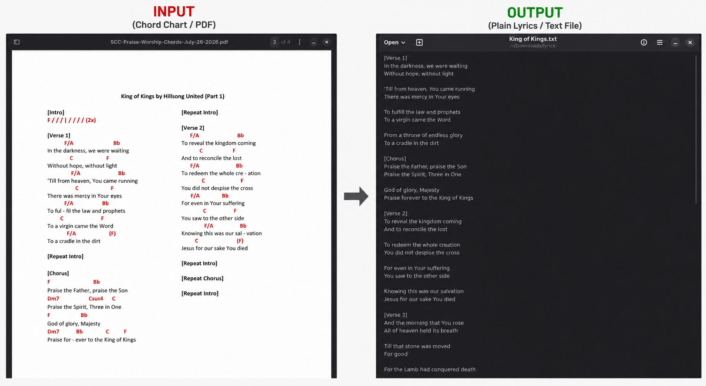

## Summary

This is a follow-up to my [first ProPresenter lyrics formatter](/projects/propresenter-lyrics-formatter), built after watching my churchmates actually use it. The original required people to upload a file and correctly tell the system whether it was one song per file or one song per page, which turned out to be a confusing and error-prone step for non-technical volunteers.

This version replaces that with a dedicated, access-gated web page for Solace of Christ Church (SCC). Volunteers paste in their chord chart text or upload the PDF file, the app extracts the lyrics client-side, and the results come back already split into individual songs with proper file names, ready to download one by one or as a single zip.

## The Problem

The first version worked, but the upload flow put too much cognitive load on volunteers:

* They had to correctly classify their own file as "one song per file" or "one song per page" before uploading, a distinction that wasn't always obvious from the source document.
* A wrong selection produced garbled output, with no clear indication of what went wrong.
* There was no dedicated interface, so the tool felt like a generic file-upload utility rather than something built for their weekly routine.
* Getting multiple formatted songs back meant repeating the same upload-and-download cycle for each one.

## Project Objectives

The goals for this iteration were to:

* Remove the need for volunteers to classify their own input.
* Give SCC a dedicated, purpose-built page instead of a generic upload form.
* Restrict access to SCC members only, since the tool is tailored to their specific chord chart format.
* Return each song as a properly named, individually downloadable file, plus a zip of the full set.
* Simplify the backend workflow so it's easier to maintain and extend.

## The Solution

Instead of asking users to upload a PDF and guess at its structure, the new page has them paste the extracted chord chart text directly. Text extraction from the PDF now happens client-side in the browser, so the app always receives plain text and never has to guess how the source file was structured.

That text is sent to an n8n workflow that runs it through a multi-step LLM chain: grouping the raw text into individual songs, cleaning up chord and formatting artifacts, and converting each song into ProPresenter-ready format. The formatted songs are returned to the page, each with an auto-generated file name, so volunteers can grab a single song or download everything at once as a zip.

The page itself is gated behind an access code, since it's built specifically for SCC's chord chart format and isn't meant for general public use.

## Technical Implementation
### Workflows

#### Workflow 1: Lyrics Formatting Pipeline

1. A webhook receives the extracted chord chart text from the client-facing page, along with the signature header.
2. An `If` node validates the access code; requests that fail validation get a `401` response and stop there.
3. An LLM call (Extract Lyrics) identifies and groups the raw text into individual songs.
4. `Split Out` breaks the grouped result into one item per song so each is processed independently downstream.
5. An LLM call (Artifacts Cleaner) strips chord symbols, stray whitespace, and other formatting artifacts from each song.
6. An LLM call (ProPresenter Formatter) converts the cleaned lyrics into ProPresenter-ready structure.
7. `Edit Fields` assigns each song a proper file name.
8. `Aggregate` collects all formatted songs back into a single response.
9. `Respond to Webhook` returns the finished set to the page for individual or zipped download.

#### Sample Output

## Challenges

The main challenge was rethinking where responsibility for extraction should live. The first version tried to handle every kind of PDF layout inside the n8n workflow itself, which is what led to the confusing "one song per file vs. one song per page" toggle in the first place.

For this version, I moved text extraction out of n8n and into a dedicated client-facing app, so the workflow only ever deals with plain text. This simplified the n8n side considerably, but it meant designing the client app to reliably extract text from SCC's specific chord chart PDFs before handing it off. Splitting the responsibility this way took a few iterations to get right, but it made both halves of the system simpler than trying to handle everything in one place.

## Results

Volunteers no longer have to think about file structure at all. Since the page is dedicated to SCC and pre-configured for their chord chart format, the entire interaction is reduced to pasting text in or uploading the PDF file and downloading formatted songs out, individually or as a zip. What used to be a multi-step, error-prone upload process is now a much smoother, purpose-built workflow.

## Lessons Learned

Watching real users struggle with the first version reinforced that user experience isn't something to bolt on after the workflow is built, it should shape the workflow itself. Prioritizing UX led me to restructure the whole pipeline: moving extraction to a dedicated client app, gating access, and returning properly named, individually downloadable files. The result wasn't just a friendlier interface, it was a genuinely simpler and more maintainable system.