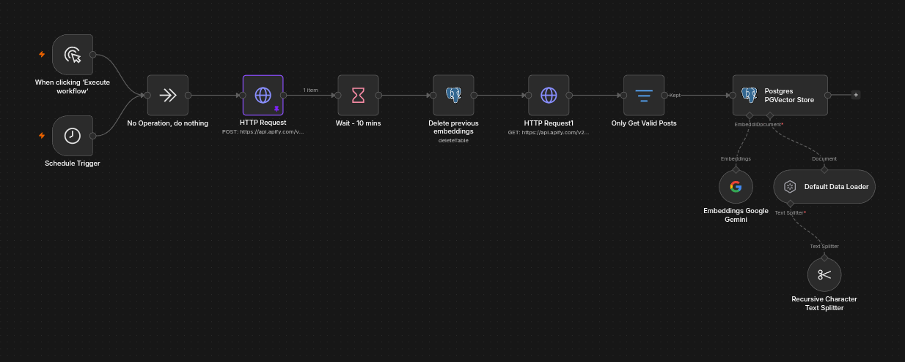
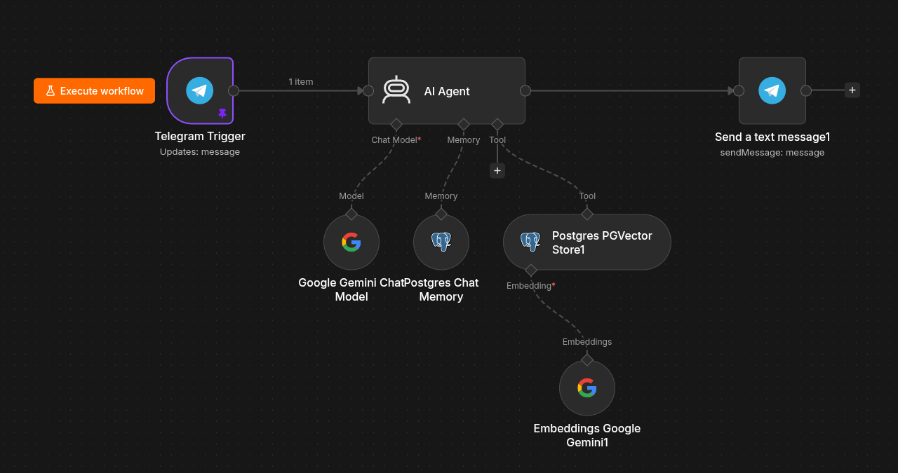

## Summary

Smart Reddit Search is an AI-powered retrieval system that continuously indexes Reddit discussions and uses Retrieval-Augmented Generation (RAG) to answer questions grounded in those discussions. Instead of relying solely on an LLM's internal knowledge, the system retrieves relevant Reddit posts using Apify, processes them into searchable embeddings, and generates responses grounded in actual community discussions.

The entire workflow is orchestrated using n8n, combining web search, data processing, vector search, and large language models into a single automated pipeline.

## The Problem

Large language models often struggle with questions that depend on real user experiences or rapidly changing information. While Reddit contains valuable discussions, manually searching through multiple threads is slow and often produces inconsistent results.

## Project Objectives

The goal was to build a system capable of automatically finding relevant Reddit discussions, extracting useful information, and generating concise answers supported by retrieved context.

* Build an end-to-end RAG pipeline using n8n.
* Automatically retrieve relevant Reddit discussions.
* Convert Reddit content into searchable vector embeddings.
* Use an AI agent to retrieve the most relevant context before generating answers.
* Produce responses grounded in retrieved Reddit discussions instead of relying solely on the language model.

## The Solution

The workflow uses a schedule trigger that runs at a weekly interval. This retrieves the latest Reddit posts from specific subreddits using Apify, processes them into searchable embeddings, and stores them in a vector database.

When a user submits a question (e.g. "I need posts wherein users require assistance"), the system performs semantic similarity search against the stored embeddings, retrieves the most relevant discussions, and provides them to the language model as context. The model then generates an answer based on the retrieved information rather than hallucinating unsupported facts.

The entire process runs automatically inside n8n without manual intervention.

## Technical Implementation
### Workflows

#### Workflow 1: Search Reddit
1. Retrieve latest posts from specific subreddits using Apify.
2. Add a safety filter to remove data that is not of data type "post".
3. Generate embeddings.
4. Store embeddings in a vector database (in my case, PGVector).

#### Workflow 2: AI Agent with RAG
1. User submits a question.
2. The AI agent performs semantic search using the pgvector tool.
3. Relevant Reddit posts are returned as context.
4. The language model generates a grounded response.
5. The response is sent back to the user.

## Challenges

One of the challenges I faced was figuring out how to use the data loader node. Just simply importing the json data into the node wasn't working because the embedding model was returning empty arrays, which caused the node to fail. I modified the data loader so only the title and body were embedded while the remaining fields were stored as metadata. This prevented empty embedding arrays and allowed the documents to be indexed correctly.

## Results

This project saved me **at least 20 hours of work per week** searching through Reddit for relevant discussions. By automating the process, I can just prompt the AI agent to search for specific topics, and it will do the rest.

The workflow enables natural-language search across thousands of indexed Reddit discussions, allowing relevant community insights to be retrieved in seconds instead of manually searching through multiple threads.

## Lessons Learned

Building a RAG system involves much more than connecting an LLM to a vector database. Data quality, chunking strategy, retrieval accuracy, and prompt design have a significant impact on the final output.

This project also demonstrated that low-code automation platforms like n8n can orchestrate sophisticated AI workflows while remaining easy to maintain and extend.

Moreover, the project can be extended for other use cases beyond Reddit. For example, we can use the same system to search for relevant trends in the market, or to find relevant news articles. It can also be used to search for relevant images, videos, and documents (e.g. documents containing FAQs, legal documents, and contracts).

## Future Improvements

* Maybe add an intent classifier before sending the request to the LLM. This would allow the query to be directed towards the most relevant AI agent or LLM. This would also allow for more complex prompts and better retrieval accuracy.
* Use a more deterministic approach to retrieval. The current implementation uses a straightforward semantic retrieval pipeline without techniques such as query rewriting, reranking, or hybrid search. We could also add query enrichment to the prompt to make the retrieval more accurate.
* Try different RAG design patterns. The system currently uses a naive approach to embedding and retrieval. We could try different design patterns to improve the system's performance and accuracy.
