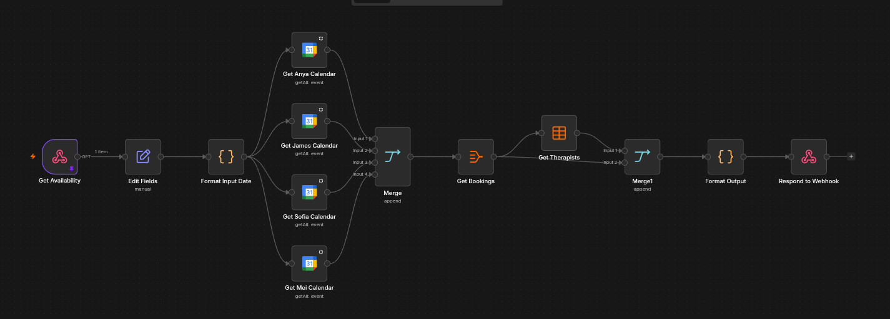
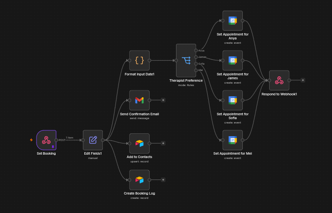

https://www.loom.com/share/577ab90414ca45ada1dc5a6f82f116d7

## Summary

This project automates the appointment booking process for spa businesses through a dedicated booking page. Guests can select their preferred therapist, view that therapist's real-time availability, and confirm a booking without any manual coordination.

Behind the page, an n8n backend checks each therapist's Google Calendar and Airtable records to surface open timeslots, then handles the full booking: creating the calendar event, sending a confirmation email, and saving the guest's contact and booking details to Airtable.

## The Problem

Spa businesses commonly handle booking inquiries manually across Facebook Messenger, SMS, and phone calls. Each inquiry requires a staff member to check therapist availability, confirm a slot, and manually record the guest's details, an exchange that can take minutes to complete and often stalls entirely outside business hours or when staff are occupied with walk-in guests.

That delay costs bookings. At an estimated 2 missed bookings per day and an average guest spend of ₱1,000, a spa can lose up to ₱60,000 in bookings every month, all from inquiries that were never followed up on quickly enough to convert.

## Project Objectives

The objective of this project is to replace manual, channel-by-channel booking coordination with a self-service booking page that guests can use directly. Specifically, the project aims to:

- Provide a dedicated booking page guests can use without messaging the business.
- Let guests choose their preferred therapist and view that therapist's real-time available dates and timeslots.
- Automatically create the appointment on the correct therapist's calendar once a booking is confirmed.
- Send an automated confirmation email to the guest immediately after booking.
- Save the guest's contact and booking information to a database (Airtable, for this demo) without manual data entry.

## The Solution

To eliminate manual booking coordination, I built a two-part n8n backend behind the booking page. The first workflow powers an availability-check API: when a guest selects a therapist, it queries that therapist's Google Calendar alongside existing Airtable bookings and returns the open dates and timeslots in real time.

The second workflow powers a booking-submission API: once a guest confirms a slot, it creates the appointment on the correct therapist's calendar, emails the guest a confirmation, and saves their contact and booking details to Airtable, all in parallel.

This is a demo built to show spa businesses what an automated booking flow could look like, so it's scoped to the happy path: a guest checking availability and booking a valid, open slot.

## Technical Implementation

### Workflow 1: Availability Check

1. A webhook receives the availability request and formats the requested date.
2. The workflow queries each therapist's Google Calendar (Anya, James, Sofia, and Mei) in parallel to retrieve existing events.
3. The results are merged, then cross-referenced against the "Bookings" and "Therapists" tables in Airtable.
4. The combined availability is formatted and returned through the webhook response, giving the booking page real-time open dates and timeslots per therapist.

### Workflow 2: Booking Submission

1. A webhook receives the booking submission once a guest confirms a slot.
2. The therapist preference is routed through a rules-based switch to the corresponding branch.
3. In parallel, the workflow:
   - Creates the appointment on the selected therapist's Google Calendar and responds through the webhook.
   - Sends an automated confirmation email to the guest via Gmail.
   - Upserts the guest's details into the Airtable "Contacts" table.
   - Creates a record of the booking in the Airtable "Booking Log" table.

## Challenges

The biggest unsolved challenge is scaling past a handful of therapists. Both workflows currently have a dedicated node per therapist, a separate "get calendar" node for each therapist in the availability check, and a rules-based switch that branches into a separate "create appointment" node for each therapist in the booking submission. That works cleanly for four therapists, but it means every new therapist added to the business requires manually wiring up new nodes and branches in both workflows. At 10+ therapists this becomes unwieldy to build and maintain, and I haven't yet settled on the right way to make the calendar lookup and appointment creation steps dynamic instead of hardcoded per therapist.

As a demo scoped to the happy path, it doesn't yet handle cases like two guests booking the same slot at nearly the same time, since availability is checked and booking is submitted as two separate requests with no lock or re-validation in between. That's an intentional scope cut for a proof of concept meant to pitch the concept to spa businesses, not a production booking system.

## Results

The booking page demonstrates how guests could view real-time openings and confirm an appointment entirely on their own, without reaching out over Messenger, SMS, or a phone call. Every booking is automatically logged in Airtable with a confirmation email sent immediately, showing spa businesses how this approach would capture and confirm inquiries the moment a guest submits them, directly addressing the lost-booking problem described above.

## Lessons Learned

I learned that not every automation needs AI. This workflow relies entirely on deterministic logic, calendar lookups, rules-based routing, and database writes, which makes it more predictable and easier to debug than an LLM-driven flow would be for a task that doesn't require natural language understanding.

## Future Improvements

- Redesign the calendar lookup and appointment creation steps to scale dynamically with the number of therapists, instead of one hardcoded node per therapist, so the workflow can support 10+ therapists without growing linearly in complexity.
- Add double-booking prevention, such as a locking step or re-validating availability at submission time, before moving this beyond a demo.
- Add appointment reminders via SMS or email sent automatically before the scheduled booking time.
- Support guest-initiated rescheduling and cancellation instead of requiring the business to make changes manually.
- Add a waitlist flow so guests can be notified automatically if a slot opens up after a therapist becomes fully booked.
- Build a simple analytics view on top of the Airtable booking log to track booking volume, popular timeslots, and no-show rates.
