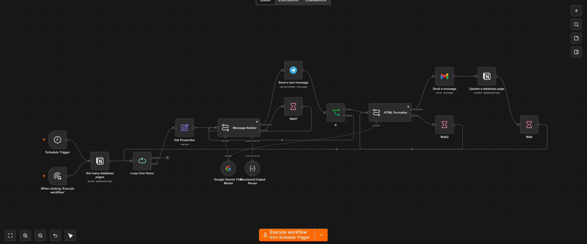
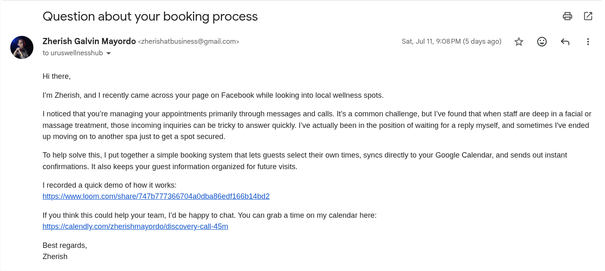
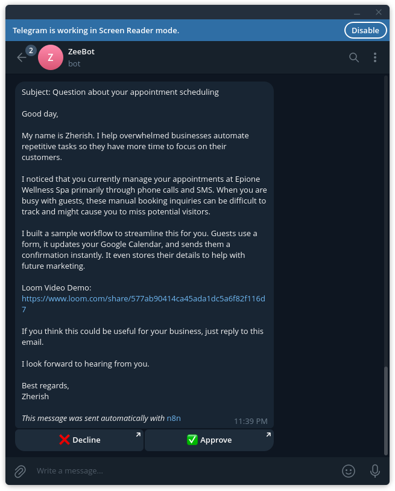

https://www.loom.com/share/faa4ed5be576449a86da9808f2319b50

## Summary

This project automates the end-to-end cold email outreach process for spa businesses. It retrieves leads from a database. Then, it uses AI to generate personalized email subjects and messages tailored to each business. It also includes a human approval step through Telegram before sending any email. Once approved, another AI converts the email into HTML and delivers it to the lead. After that, it updates the lead's status, and the process repeats for every lead. This reduces manual effort while maintaining personalized, high-quality outreach.

## The Problem

Sending personalized cold emails manually was repetitive and time-consuming. For every lead, I had to copy a previous email, review my research notes in Notion, generate a personalized email using AI, regenerate it if it didn't match my writing style, copy the subject and body into my email client, add my Loom demo video link, proofread everything, and finally send the email.

This process took 5 to 7 minutes per lead, making it difficult to scale outreach. As the number of leads grew, the manual work became a bottleneck. I was spending more time copying, pasting, and refining AI-generated emails than actually reaching out to prospects, while also increasing the risk of mistakes such as using the wrong content or overlooking important details.

## Project Objectives

The objective of this project is to automate the end-to-end cold email outreach process for spa businesses, reducing the time and manual effort required to send personalized emails. Specifically, the project aims to:

- Automate lead retrieval from a Notion database.
- Generate personalized email subjects and messages using AI based on each lead's information.
- Include a human approval step through Telegram to ensure email quality before sending.
- Automatically convert approved emails into HTML for professional formatting.
- Send personalized emails without manual copying or formatting.
- Update each lead's status in Notion after the email is sent.

## The Solution

To eliminate the repetitive manual work, I developed an AI-powered cold email outreach automation using n8n, LLMs, Notion, and Telegram. The workflow automatically retrieves leads from a Notion database, generates personalized email subjects and messages using AI, and sends a preview to Telegram for human approval. Once approved, the email is converted into HTML, delivered to the lead, and the lead's status is updated in Notion.

## Technical Implementation
### Workflows

#### Workflow 1: Email Outreach Pipeline
1. Retrieves all leads from the Notion database.
2. An LLM generates a personalized email subject and message using each lead's information and spa-specific context.
3. The LLM sends a preview of the email through Telegram for approval. If approved, the workflow proceeds to the next step. If rejected, the LLM generates a new version and sends it for approval again.
4. A second LLM converts the approved email into HTML.
5. The email is sent to the lead.
6. The lead's status is updated to **"Contacted"** in Notion.
7. The process repeats until all leads have been contacted.

### Example

## Challenges

One of the biggest challenges was prompt engineering. I wanted the AI-generated emails to match my writing style and feel genuinely personalized rather than sounding like generic marketing templates. Achieving this required multiple iterations of prompt refinement, adjusting the instructions and context until the generated emails consistently followed the desired structure and tone.

Another challenge was dealing with the Gemini API's rate limits during batch processing. When the API limit was reached, email generation would fail and interrupt the workflow. To make the automation more reliable, I implemented a basic error-handling path that waits for one minute before retrying the request, allowing the rate limit to reset and the workflow to continue without manual intervention.

## Results

The automation eliminated repetitive manual tasks such as generating email content, copying subjects and messages between applications, formatting emails, and updating lead records.

Instead of spending 5 to 7 minutes preparing each email, the process now requires only a quick review and approval before sending. This significantly reduces the time required for outreach while making it easier to contact a larger number of prospects with consistent, personalized emails.

## Lessons Learned

This project taught me the importance of human-in-the-loop (HITL) workflows when using LLMs for customer-facing content. While AI can generate high-quality personalized emails, a human approval step ensures the content is accurate, natural, and aligned with the intended tone before it is sent.

I also learned that iterative prompt engineering is essential for achieving consistent, high-quality outputs. Refining the prompts through repeated testing significantly improved the structure, personalization, and overall quality of the generated emails, making them feel less like generic templates and more like messages I would write myself.

Finally, I learned that reliable automation requires robust error handling. Since external AI services are subject to API rate limits, implementing retry logic with a delay allowed the workflow to recover automatically from temporary failures, improving its reliability without requiring manual intervention.

## Future Improvements

- Automate follow-up emails by sending personalized follow-up messages to leads who have not replied after a configurable number of days.
- Integrate lead enrichment services to gather additional business information, enabling more personalized and relevant email content.
- Improve AI personalization by incorporating information from the lead's website, social media, or online reviews to create more tailored outreach.
- Support multiple outreach campaigns with reusable templates and configurable prompts for different industries, not just spa businesses.
- Handle more edge cases by improving validation, retry logic, and fallback mechanisms for scenarios such as missing lead information, invalid email addresses, API failures, and unexpected LLM outputs.
