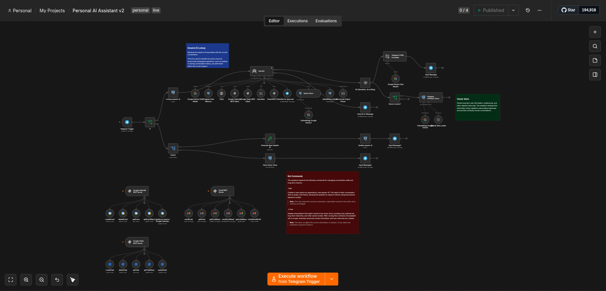
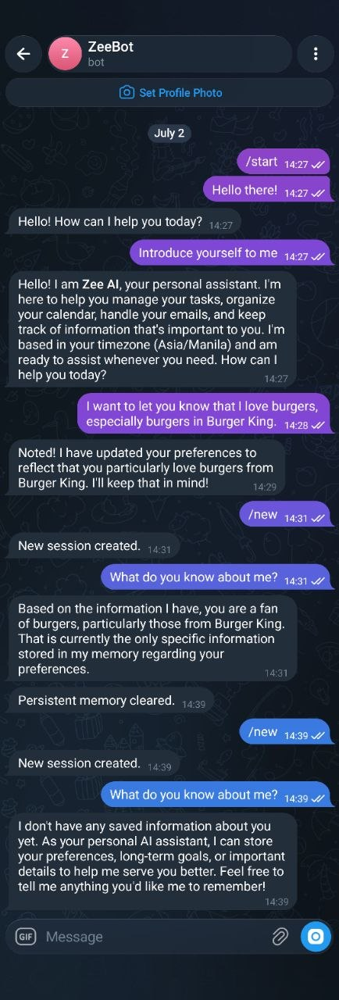
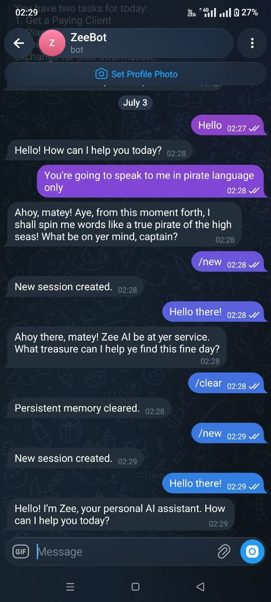
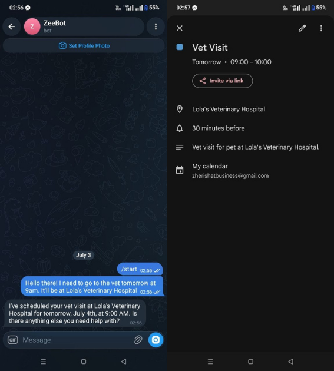
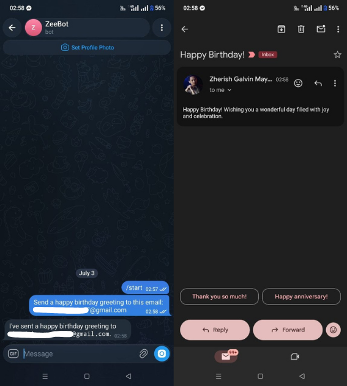
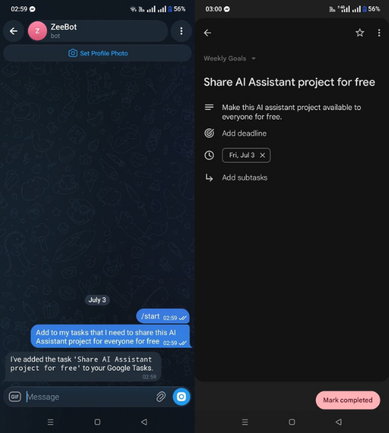

## Summary

Having to manually switch applications in your phone to access Google Calendar, Gmail, and Tasks is a hassle. This project automates the process by creating a personal assistant for Telegram that remembers user preferences and provides relevant responses. The system uses a vector database to provide long-term memory for user preferences and MCP client tools to securely interact with Google Calendar, Gmail, and Google Tasks.

It can also interact with Google services such as Calendar, Gmail, and Tasks in order to lessen context switching. By having a personal assistant, users can manage their tasks and communications more efficiently and in a single platform.

## The Problem

Managing multiple applications for tasks, emails, and calendar events can be time-consuming and inefficient. Users often have to switch between different apps, which disrupts their workflow and leads to lost productivity.

## Project Objectives

The goal of this project was to create a personal assistant for Telegram that can integrate with Google services and generate personalized responses using retrieved user preferences and conversation context. The personal assistant should be able to:

* Integrate with Google Calendar, Gmail, and Tasks to manage events, emails, and tasks.
* Store user preferences in a vector database for long-term memory.
* Provide relevant responses based on user preferences and context.
* Interact with Google services to reduce context switching.

## The Solution

In this project, the personal assistant relies on Telegram's API to interact with users. It uses a vector database to store user preferences and retrieves relevant information from the database when needed. The assistant can also interact with Google services such as Calendar, Gmail, and Tasks to manage events, emails, and tasks by providing MCP client tools to the agent which connects to the MCP server handling the Google Services.

The bot is created through BotFather, a Telegram bot creation tool. It can be interacted directly, or added to a group or channel. Through this bot, users can interact with the personal assistant by sending commands such as "Create a new task", "Add an event to my calendar", or "Send an email to this email address".

## Technical Implementation
### Workflows

#### Workflow 1: Personal Assistant Pipeline

1. User sends a message to the Telegram bot.
2. The bot receives the message and checks if it is a command or not.
3. If it is a command, the workflow checks the command and executes the corresponding action (e.g., clearing the memory, creating a new session).
4. If it is not a command, it then checks the session id of the user.
5. The message is passed to the agent.
6. The agent retrieves relevant user preferences from the vector database.
7. If the request requires Google services, the agent invokes the appropriate MCP tool.
8. The MCP server performs the requested Google action.
9. The agent generates a response and sends it back through Telegram.

### Examples

#### Example 1

In this example, I tested the personal assistant's capability of storing user preferences and retrieving them when needed. The assistant was able to remember my preferences even after creating a new session.

#### Example 2

Another example of the personal assistant's capability of storing user preferences and testing it's ability to follow my preferences. The assistant was able to remember that I want it to speak only in a pirate language even after creating a new session.

#### Example 3

#### Example 4

#### Example 5

## Challenges

One of the challenges I faced when building this project was designing the prompts and structuring the agent's responses. Without a proper structure of the responses, the agent would not be able to store user preferences and provide relevant responses.

Another challenge was designing the agent's memory. To be able to properly store user preferences, I need the agent to know about the metadata of the user's preferences, so that it can determine which preferences are relevant or have higher priority.

## Results

I was able to build a personal assistant for Telegram that can integrate with Google services and provide relevant responses based on user preferences. The personal assistant can manage tasks, emails, and calendar events in a single platform, and can save users up to **10-15 minutes a day**.

## Lessons Learned

I was able to learn a lot from this project. First, I gained a better understanding on how to structure the agent's responses and prompts. Second, I was able to properly design the agent's memory to store user preferences and retrieve them when needed. Lastly, I learned about MCP client and servers, which allow the agent to discover the tools it can use without the need to hardcode them into the agent.

## Future Improvements

There are a lot of potential improvements that can be made to this project. Some of the improvements I would like to make in the future include:

* Integrating with other Google services such as Drive, Sheets, and Slides.
* Adding sub-agents to the personal assistant to assist with specific tasks that may require more specialized knowledge.
* Being able to search in the web for relevant information to provide more accurate and up to date responses.
* Ability to process documents and store them in a separate vector database.